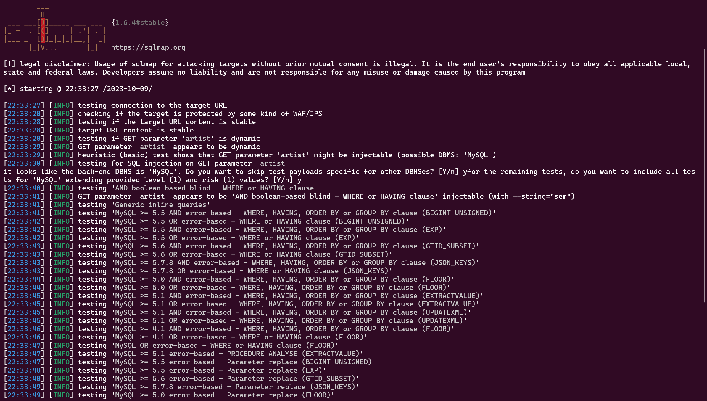
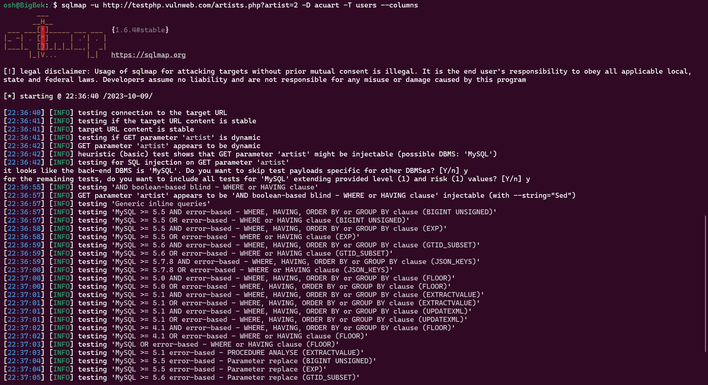
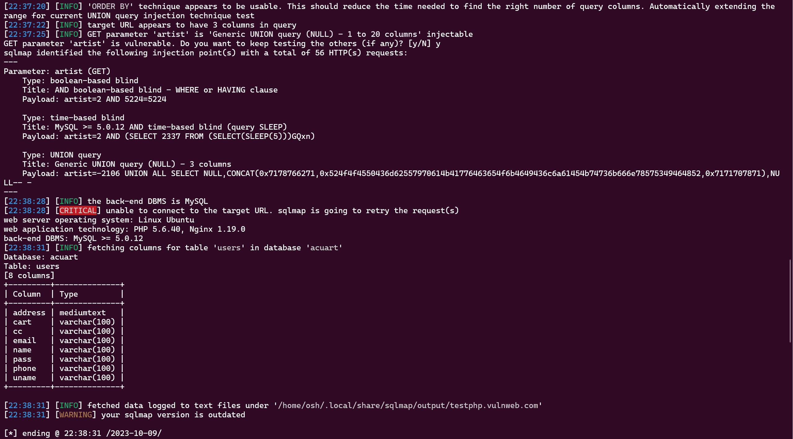
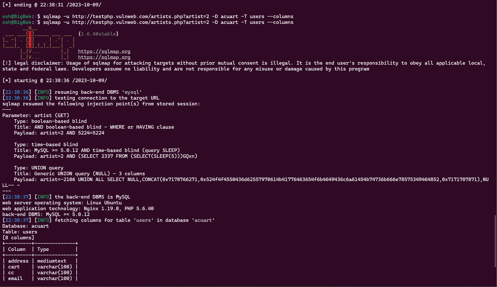
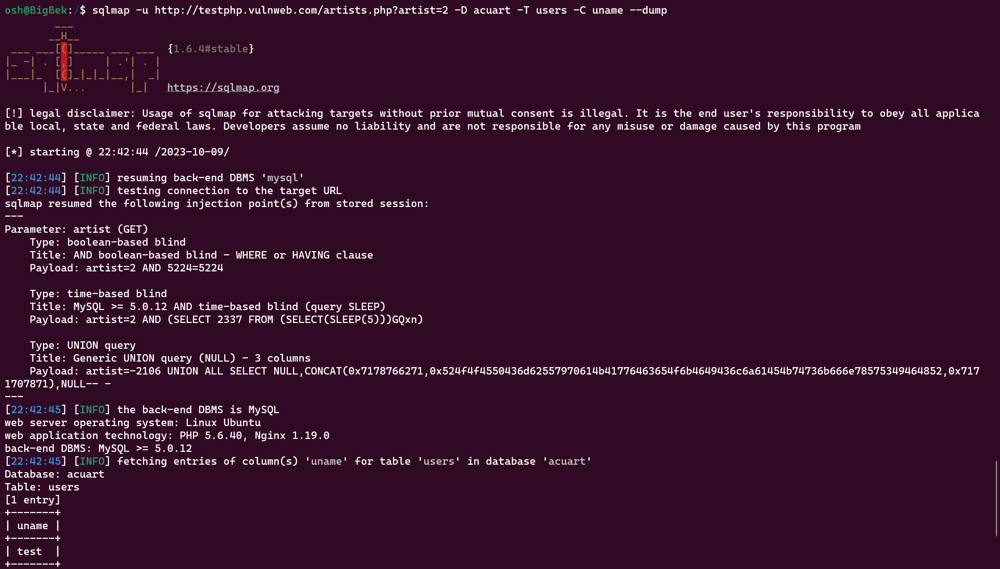
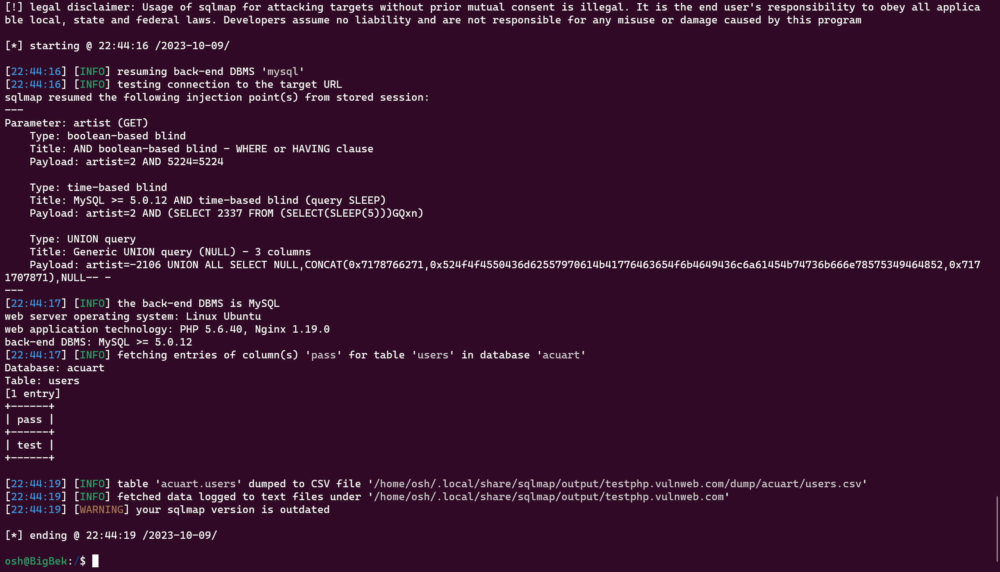

# 🧑🏽‍💻 Task 1: 10 Most Notorious Hackers

#### 📅23rd August 2023📅

In the world of cybersecurity, certain individuals have gained notoriety for their hacking skills and activities. This list compiles the 10 most notorious hackers in history, each with their unique stories and impact on the cybersecurity landscape.

1. **Kevin Mitnick:**
   A prominent American hacker, Kevin Mitnick began his hacking journey as a teenager. His infamous hack into NORAD in 1982 inspired the movie "War Games." Mitnick gained notoriety by hacking DEC's software in 1989, putting him on the map as one of the most skilled hackers. Despite facing arrests, Mitnick later shifted his focus to ethical hacking, conducting network security testing, and even launching an exploit exchange.

2. **Anonymous:**
   Anonymous, a loosely organized hacker collective, emerged in 2003. They are known for their focus on social justice causes. Anonymous has targeted various organizations and individuals, including the Church of Scientology, often using Guy Fawkes masks in their protests. The lack of a hierarchical structure within Anonymous makes it challenging for authorities to eliminate the group entirely.

3. **Adrian Lamo:**
   Adrian Lamo gained notoriety for his unusual approach to hacking. Rather than exploiting his findings, Lamo would notify the press and victims after gaining unauthorized access. He famously hacked The New York Times and earned the nickname "Homeless Hacker." Lamo's motivations were mixed, as he aimed to aid security but also engaged in intrusive actions.

4. **Albert Gonzalez:**
   Albert Gonzalez's hacking journey began as a "troubled" high schooler but quickly escalated. He turned into a major card data thief, orchestrating some of the largest data breaches in history. Gonzalez later became an informant for the Secret Service while continuing his hacking activities, leading to the theft of millions of payment card accounts.

5. **Matthew Bevan & Richard Pryce:**
   In 1996, British hackers Matthew Bevan and Richard Pryce breached military networks, nearly causing a global conflict. Their actions exposed the vulnerabilities of military networks and raised significant concerns about cybersecurity in the military.

6. **Jeanson James Ancheta:**
   Jeanson James Ancheta focused on building and renting out botnets for profit. He infected around 400,000 computers, making him the first hacker to be imprisoned for botnet use. His activities highlighted the growing threat of botnets in the cybercriminal landscape.

7. **Michael Calce:**
   Michael Calce, also known as "Mafiaboy," gained notoriety at the age of 15 when he launched a series of DDoS attacks on major websites, causing widespread chaos. His actions triggered a significant focus on cybercrime legislation due to the ease with which a teenager disrupted major online platforms.

8. **Kevin Poulsen:**
   Kevin Poulsen began his hacking career by infiltrating ARPANET. He later went underground but eventually turned to "white hat" hacking, using his skills for ethical purposes. Poulsen co-developed SecureDrop, a platform for secure communication that serves whistleblowers and journalists.

9. **Jonathan James:**
   Jonathan James, also known as "c0mrade," gained notoriety for hacking into government systems when he was just 15 years old. His actions led to convictions under cybercrime laws. Unfortunately, James committed suicide at the age of 24, citing a lack of faith in the justice system.

10. **ASTRA:**
    ASTRA, an anonymous Greek mathematician, remains a mysterious figure in the hacking world, as their true identity has never been fully revealed. ASTRA targeted the Dassault Group for several years, stealing valuable technology. Their actions resulted in approximately $360 million in damages.

These hackers, whether for personal gain, social justice causes, or notoriety, have left a significant impact on the world of cybersecurity. While some have shifted their focus to ethical hacking or faced legal consequences, their stories serve as a reminder of the ongoing battle against cyber threats in the digital age.

# 🌐 Task 2: Port Vulnerabilities

#### 📅25th August 2023📅

When conducting network security assessments, it is crucial to identify open ports on a system and assess potential vulnerabilities associated with those ports. Here, we outline common vulnerabilities and potential attacks for each of the identified open ports on a system.

1. **Port 20, 21 (FTP):**
    - **Vulnerabilities:** Weak authentication, plaintext credentials transmission.
    - **Attacks:** Brute force attacks to guess passwords, FTP bounce attacks to proxy connections, data exfiltration.
    
2. **Port 22 (SSH):**
    - **Vulnerabilities:** Weak passwords, outdated SSH versions.
    - **Attacks:** Brute force attacks, dictionary attacks, key-based authentication attacks.
    
3. **Port 23 (Telnet):**
    - **Vulnerabilities:** Lack of encryption, plaintext communication.
    - **Attacks:** Password sniffing, man-in-the-middle attacks, session hijacking.
    
4. **Port 25 (SMTP):**
    - **Vulnerabilities:** Open relay, email spoofing.
    - **Attacks:** Spamming, email flooding, phishing attacks.
    
5. **Port 53 (DNS):**
    - **Vulnerabilities:** DNS cache poisoning, zone transfer misconfigurations.
    - **Attacks:** DNS spoofing, DDoS amplification attacks, traffic redirection.
    
6. **Port 69 (TFTP):**
    - **Vulnerabilities:** Lack of authentication and security features.
    - **Attacks:** Data interception, unauthorized file transfers.
    
7. **Port 80 (HTTP) and 443 (HTTPS):**
    - **Vulnerabilities:** Web application vulnerabilities (e.g., SQL injection, cross-site scripting), outdated software.
    - **Attacks:** Web application attacks, credential theft, defacement.
    
8. **Port 110 (POP3) and 143 (IMAP):**
    - **Vulnerabilities:** Weak credentials, plaintext communication.
    - **Attacks:** Brute force attacks, email interception.
    
9. **Port 123 (NTP):**
    - **Vulnerabilities:** NTP amplification attacks, source address spoofing.
    - **Attacks:** DDoS attacks using NTP servers for amplification.
    
10. **Port 443 (HTTPS):**
    - **Vulnerabilities:** Same as mentioned for HTTP, plus SSL/TLS vulnerabilities.
    - **Attacks:** Secure web application attacks, MITM attacks targeting encrypted traffic.

These vulnerabilities and potential attacks serve as a reminder of the importance of maintaining strong security measures, including robust authentication, encryption, and regular updates, to mitigate the risks associated with open ports on a system.

# 🛡️ Task 3: Top 5 OWASP CWE Descriptions with Business Impact

#### 📅25th August 2023📅

In the realm of cybersecurity, the Open Web Application Security Project (OWASP) maintains a list of the most critical web application security risks known as the OWASP Top Ten. These risks are typically categorized by their Common Weakness Enumeration (CWE) identifiers. In this task, we will explore the top 5 OWASP CWE descriptions and delve into their potential business impacts.

## 1. **CWE-79: Improper Neutralization of Input During Web Page Generation ('Cross-site Scripting' - XSS)**

**Description:** CWE-79 represents a vulnerability where an application includes untrusted data in the content sent to a web user's browser. This could allow an attacker to inject malicious scripts into a website, which are then executed in the context of the victim's browser.

**Business Impact:** XSS attacks can have severe business consequences. Attackers can steal sensitive user data, such as login credentials or personal information, leading to reputational damage and potential legal consequences. Additionally, successful XSS attacks can compromise user sessions and lead to unauthorized access to critical systems.

## 2. **CWE-89: Improper Neutralization of Special Elements used in an SQL Command ('SQL Injection')**

**Description:** CWE-89 represents a vulnerability where an application does not properly validate or sanitize user-supplied input that is incorporated into SQL queries. Attackers can manipulate SQL queries, potentially leading to unauthorized data access or modification.

**Business Impact:** SQL injection attacks can expose sensitive business data, including customer records, financial information, and intellectual property. Such incidents can lead to financial losses, legal liabilities, and significant damage to an organization's reputation.

## 3. **CWE-20: Improper Input Validation**

**Description:** CWE-20 refers to a broader category of vulnerabilities where an application does not sufficiently validate input from users or other untrusted sources. This can lead to a wide range of security issues, including buffer overflows, data leakage, and authentication bypass.

**Business Impact:** The impact of CWE-20 vulnerabilities depends on the specific context. However, they can result in data breaches, system downtime, and potential financial losses. Moreover, they erode customer trust and may lead to regulatory compliance violations.

## 4. **CWE-312: Cleartext Storage of Sensitive Information**

**Description:** CWE-312 indicates a vulnerability where sensitive data, such as passwords or encryption keys, is stored in an insecure manner, typically in plain text or with weak encryption.

**Business Impact:** Cleartext storage of sensitive information can have a significant impact on an organization's reputation and legal standing. If attackers gain access to this data, they can exploit it for financial gain or identity theft, leading to regulatory fines and loss of customer trust.

## 5. **CWE-352: Cross-Site Request Forgery (CSRF)**

**Description:** CWE-352 represents a vulnerability where an attacker tricks a user into performing actions on a website without their consent or knowledge. This can lead to unwanted state changes on the victim's behalf.

**Business Impact:** CSRF attacks can result in unintended actions, such as fund transfers, changes to user profiles, or unauthorized purchases. This can damage the user experience, erode trust, and potentially lead to financial losses or legal issues.

# 🌐 Task 4: Understanding Top 10 Web Application Vulnerabilities (Other Than Top 10 OWASP)

#### 📅28th August 2023📅

In addition to the well-known OWASP Top 10 vulnerabilities, there are other critical web application vulnerabilities that organizations need to be aware of. Here, we explore five such vulnerabilities, providing descriptions, learn more resources, and examples of each.

### 1. Web Cache Poisoning

**Description:**
Web cache poisoning involves manipulating caching systems, like proxy servers or CDNs, to serve malicious content to multiple users who request the same content. Attackers exploit vulnerabilities in caching configurations to inject harmful scripts or content into cached responses.

**Learn More:**
- OWASP Article on [Web Cache Poisoning](https://owasp.org/www-community/attacks/Cache_Poisoning)
- Relevant courses on platforms like [Pluralsight](https://www.pluralsight.com/), [Udemy](https://www.udemy.com/), and [Coursera](https://www.coursera.org/).

**Examples:**
- In 2018, a researcher demonstrated how cached JavaScript files could be poisoned to deliver cryptocurrency mining scripts to users.
- In 2020, an attacker manipulated cached images on an e-commerce site to display fake products and redirect users to malicious sites.

### 2. HTTP Request Smuggling

**Description:**
HTTP Request Smuggling involves manipulating how front-end and back-end servers interpret HTTP requests, leading to cache poisoning, security control bypass, or facilitating other attacks like XSS and CSRF. It exploits discrepancies in how different servers interpret request headers and bodies.

**Learn More:**
- PortSwigger's Web Security Academy has a dedicated [module on HTTP Request Smuggling](https://portswigger.net/web-security/request-smuggling).
- Relevant sections in security-focused books like "The Web Application Hacker's Handbook" by Dafydd Stuttard and Marcus Pinto.

**Examples:**
- In 2019, a security researcher found that a popular web server misinterpreted content-length headers, leading to cache poisoning and redirecting users to malicious sites.
- A bug bounty program identified that an e-commerce site's server configuration allowed for HTTP request smuggling, potentially exposing sensitive customer data.

### 3. Insecure Deserialization

**Description:**
Insecure deserialization occurs when applications deserialize data without proper validation, allowing attackers to execute arbitrary code, achieve remote code execution, or trigger denial of service attacks. This vulnerability arises from improperly handling serialized objects.

**Learn More:**
- OWASP's guide on [Insecure Deserialization](https://owasp.org/www-project-top-ten/2017/A8_2017-Insecure_Deserialization)
- Online courses on platforms like [Cybrary](https://www.cybrary.it/), [edX](https://www.edx.org/), and [SANS Institute](https://www.sans.org/).

**Examples:**
- In 2016, a vulnerability in a Java deserialization library allowed attackers to execute arbitrary code remotely in widely-used applications.
- A major software company's bug bounty program revealed that a deserialization flaw in its authentication module could potentially lead to unauthorized access to critical systems.

### 4. LOG4J Vulnerability

**Description:**
The LOG4J vulnerability refers to security flaws within the Apache LOG4J library, commonly used for logging in Java applications. Attackers can exploit this vulnerability to execute arbitrary code by sending specially crafted log messages that trigger remote code execution.

**Learn More:**
- Official Apache LOG4J [documentation](https://logging.apache.org/log4j/2.x/security.html) on the vulnerability and its mitigations.
- Security advisories from software vendors and security organizations.

**Examples:**
- In 2021, a widely known software company identified and patched a critical LOG4J vulnerability in its products that could have allowed remote attackers to take over servers.
- Various bug bounty programs have awarded researchers for discovering LOG4J-related vulnerabilities in applications, underscoring the library's critical role and potential security risks.

### 5. WebRTC IP Leakage

**Description:**
WebRTC IP Leakage occurs when Web Real-Time Communication (WebRTC) protocols inadvertently expose users' real IP addresses to websites they visit. This vulnerability compromises user privacy and can potentially lead to tracking and targeted attacks.

**Learn More:**
- Mozilla Developer Network's guide on [WebRTC Security](https://developer.mozilla.org/en-US/docs/Web/API/WebRTC_API/Security)
- Online courses on web security and networking offered by platforms like [LinkedIn Learning](https://www.linkedin.com/learning/) and [Pluralsight](https://www.pluralsight.com/).

**Examples:**
- Researchers have demonstrated how malicious websites can exploit WebRTC to obtain users' real IP addresses, potentially revealing their geographical location and personal information.
- A security researcher participating in a bug bounty program identified an e-commerce site that inadvertently leaked customers' IP addresses due to WebRTC misconfiguration.

Understanding these web application vulnerabilities beyond the OWASP Top 10 is essential for organizations to fortify their security posture and protect against a wider range of potential threats. Each of these vulnerabilities presents unique challenges and requires tailored mitigation strategies to ensure the safety of web applications and their users.

# 🌐 Task 5: Understanding 10 Web Server Attacks
#### 📅29th August 2023📅
In the realm of web server security, understanding potential vulnerabilities and attack vectors is crucial. Below, we discuss 10 web server attacks, providing descriptions 

### 1. Slowloris Attack

**Description:**
A Slowloris attack is a type of Denial of Service (DoS) attack that targets web servers by sending a large number of HTTP requests with incomplete headers. This keeps server connections open, exhausting resources and hindering legitimate requests.

### 2. HTTP Flood Attack

**Description:**
An HTTP Flood attack is a DDoS attack that overwhelms a web server with a massive volume of HTTP requests, depleting its resources and causing unavailability to legitimate users.

### 3. Nginx and Apache Exploits

**Description:**
Exploiting vulnerabilities in popular web server software like Nginx and Apache can lead to unauthorized access, data leaks, and server compromises.

### 4. DNS Amplification Attack

**Description:**
A DNS Amplification attack abuses misconfigured DNS servers to amplify attack traffic, overwhelming the target server.

### 5. Slow POST Attack

**Description:**
Similar to Slowloris, a Slow POST attack targets web servers by sending incomplete or slow POST requests, tying up server resources.

### 6. HTTP Range Request Attack

**Description:**
An HTTP Range Request attack abuses the HTTP Range header to request specific portions of a file, causing server processing overhead.

### 7. Reverse Proxy Bypass

**Description:**
Attackers attempt to bypass reverse proxy protections, exposing backend servers to attacks like SQL injection, XSS, and more.

### 8. Server Side Request Forgery (SSRF)

**Description:**
SSRF attacks trick web servers into making unintended requests, potentially exposing sensitive information or leading to remote code execution.

### 9. HTTP Verb Tampering

**Description:**
HTTP Verb Tampering involves altering HTTP methods in requests to bypass security controls and gain unauthorized access to resources.

### 10. Web Cache Poisoning

**Description:**
Web Cache Poisoning manipulates caching systems to serve malicious content to users, exploiting vulnerabilities in caching configurations.

Understanding these web server attacks is essential for safeguarding web applications and their users. Implementing security measures and staying vigilant against evolving threats is key to maintaining a secure online presence.

# 📅 Task 6: Understanding CIS Policy Version 7

#### 📅 30th August 2023 📅

The Center for Internet Security (CIS) is a non-profit organization that focuses on enhancing the cybersecurity posture of organizations. They provide guidelines, best practices, and security benchmarks to help organizations secure their systems and data. CIS Policies, particularly Version 7, outline a set of recommendations and security controls to safeguard computer systems and networks. Below, we'll delve into key aspects of CIS Policy Version 7.

## CIS Policy Version 7 Overview

CIS Policy Version 7 represents an updated and refined set of security policies and controls designed to address contemporary cybersecurity threats and challenges. These policies are categorized into various domains, each targeting specific areas of security. Understanding these policies is essential for organizations striving to bolster their cybersecurity defenses.

## Key Domains and Policies

### 1. **Access Control**

The Access Control domain emphasizes controlling and managing user access to systems, applications, and data. It includes policies related to user authentication, authorization, and access management.

### 2. **Security Awareness and Training**

This domain recognizes the importance of security awareness among employees. It includes policies on security training, awareness programs, and reporting security incidents.

### 3. **Audit and Accountability**

Audit and Accountability policies focus on logging, monitoring, and auditing system activities. They help in detecting and responding to security incidents and compliance violations.

### 4. **Asset Management**

Effective asset management is crucial for identifying, tracking, and protecting critical assets. These policies guide organizations in managing their hardware, software, and data assets.

### 5. **Configuration Management**

Configuration Management policies ensure that systems and devices are properly configured to minimize security risks. This domain covers policies related to configuration baselines, change management, and vulnerability assessments.

### 6. **Incident Response**

In the event of a security incident, organizations need to respond promptly and effectively. Incident Response policies outline procedures for detecting, reporting, and mitigating security incidents.

### 7. **Security Assessment and Authorization**

This domain addresses the assessment and authorization of systems and applications. It includes policies on risk assessments, security assessments, and continuous monitoring.

### 8. **System and Communications Protection**

System and Communications Protection policies focus on safeguarding data in transit and at rest. They cover encryption, network security, and data protection mechanisms.

### 9. **Security Training and Awareness**

Promoting a culture of security awareness is essential. These policies provide guidelines for educating employees about security best practices and potential threats.

### 10. **Security Continuous Monitoring**

Continuous monitoring helps organizations identify and respond to security issues in real-time. This domain includes policies for ongoing monitoring, threat intelligence, and incident response.

## Benefits of Implementing CIS Policy Version 7

- **Enhanced Security:** Implementing these policies helps organizations establish a robust security framework to protect against cyber threats.

- **Regulatory Compliance:** Many regulations and standards require organizations to adhere to specific security controls. CIS Policy Version 7 aligns with various compliance requirements.

- **Reduced Risk:** By following CIS best practices, organizations can reduce their exposure to vulnerabilities and security breaches.

- **Improved Incident Response:** With clear incident response policies, organizations can react swiftly and effectively to security incidents.

- **Employee Awareness:** Security awareness policies promote a culture of cybersecurity within the organization, making employees more vigilant and proactive.

## Conclusion

CIS Policy Version 7 is a valuable resource for organizations seeking to bolster their cybersecurity defenses. By implementing these policies and controls, organizations can better protect their systems, data, and reputation in an increasingly digital and interconnected world. It's essential for organizations to carefully review, customize, and implement these policies according to their specific needs and risk profiles.

# **🗺️ Task 7: SQLMap Commands Documentation**
#### 📅8th September 2023📅

## **Introduction**

In this documentation, we will explore several SQLMap commands used for database penetration testing. SQLMap is a popular open-source tool designed for detecting and exploiting SQL injection vulnerabilities in web applications. These commands demonstrate various functionalities of SQLMap, including database enumeration, table discovery, and data extraction.

---

## **Command 1: Enumerating Databases**

### **Command Syntax**
```bash
sqlmap -u http://testphp.vulnweb.com/artists.php?artist=2 -dbs
```

- `-u`: Specifies the target URL.
- `-dbs`: Instructs SQLMap to enumerate the available databases.

### **Explanation**
This command instructs SQLMap to target the URL `http://testphp.vulnweb.com/artists.php?artist=2` and enumerate the available databases on the target system.



---

## **Command 2: Enumerating Tables**

### **Command Syntax**
```bash
sqlmap -u http://testphp.vulnweb.com/artists.php?artist=2 -D acuart --tables
```

- `-D acuart`: Specifies the target database (`acuart` in this case).
- `--tables`: Instructs SQLMap to enumerate the tables within the specified database.

### **Explanation**
This command targets the database `acuart` and instructs SQLMap to enumerate the tables within that database.




---

## **Command 3: Enumerating Columns**

### **Command Syntax**
```bash
sqlmap -u http://testphp.vulnweb.com/artists.php?artist=2 -D acuart -T users --columns
```

- `-D acuart`: Specifies the target database (`acuart` in this case).
- `-T users`: Specifies the target table (`users` in this case).
- `--columns`: Instructs SQLMap to enumerate the columns within the specified table.

### **Explanation**
This command targets the `users` table within the `acuart` database and instructs SQLMap to enumerate the columns within that table.



---

## **Command 4: Dumping Data**

### **Command Syntax**
```bash
sqlmap -u http://testphp.vulnweb.com/artists.php?artist=2 -D acuart -T users -C uname --dump
```

- `-D acuart`: Specifies the target database (`acuart` in this case).
- `-T users`: Specifies the target table (`users` in this case).
- `-C uname`: Specifies the target column (`uname` in this case).
- `--dump`: Instructs SQLMap to dump the data from the specified column.

### **Explanation**
This command targets the `uname` column within the `users` table of the `acuart` database and instructs SQLMap to dump the data from that column.



---

## **Command 5: Dumping Passwords**

### **Command Syntax**
```bash
sqlmap -u http://testphp.vulnweb.com/artists.php?artist=2 -D acuart -T users -C pass --dump
```

- `-D acuart`: Specifies the target database (`acuart` in this case).
- `-T users`: Specifies the target table (`users` in this case).
- `-C pass`: Specifies the target column (`pass` in this case).
- `--dump`: Instructs SQLMap to dump the data from the specified column.

### **Explanation**
This command targets the `pass` column within the `users` table of the `acuart` database and instructs SQLMap to dump the data from that column.



---

## **Conclusion**

These SQLMap commands showcase various functionalities of the tool, including database enumeration, table discovery, column enumeration, and data extraction. When used responsibly and with proper authorization, SQLMap can be a valuable tool for identifying and addressing SQL injection vulnerabilities in web applications. However, it should only be used in a legal and ethical manner, with the necessary permissions and consent.

# **📑 Task 8: Understanding WinCollect and Standalone WinCollect**
#### 📅11th September 2023📅

## **1. Introduction**

In the realm of IT security, effective log collection and management are paramount. Security Information and Event Management (SIEM) systems play a critical role in this process, and one of the key components of SIEM is log collection agents. WinCollect, developed by IBM, is a widely used log collection agent for Windows-based systems. In this document, we will explore what WinCollect is, its features, and how it differs from Standalone WinCollect.

## **2. What is WinCollect?**

**WinCollect**, also known as IBM Security QRadar WinCollect, is a log collection agent designed specifically for Windows-based systems. It is an integral part of the IBM QRadar SIEM solution, which provides organizations with the capability to collect, normalize, and send log data from Windows endpoints to the QRadar platform for analysis and correlation.

### **Features and Capabilities of WinCollect**

WinCollect offers several key features and capabilities:

- **Log Collection**: WinCollect can collect a wide range of log data, including security event logs, system logs, application logs, and custom logs.

- **Normalization**: It normalizes log data into a common format, making it easier to analyze and correlate events across the entire network.

- **Real-time Event Forwarding**: WinCollect can forward logs to the QRadar SIEM system in real-time, allowing for immediate analysis and response to security incidents.

- **Agent Auto-Update**: It supports automatic updates to ensure that the agent stays current with the latest features and security updates.

## **3. Benefits of Using WinCollect**

Organizations choose to use WinCollect for various reasons, including:

- **Integration**: WinCollect seamlessly integrates with IBM QRadar, providing a cohesive log management solution.

- **Compliance**: It helps organizations meet compliance requirements by collecting and centralizing logs for auditing purposes.

- **Real-time Monitoring**: WinCollect's real-time log forwarding capabilities enable organizations to detect and respond to security incidents promptly.

- **Normalization**: The agent's normalization capabilities make it easier to analyze logs from various Windows sources.

## **4. What is Standalone WinCollect?**

**Standalone WinCollect**, also known as IBM Security QRadar WinCollect Standalone, is a variant of WinCollect that can operate independently of the IBM QRadar SIEM platform. Unlike the standard WinCollect, Standalone WinCollect is not tied to QRadar and can be used with other SIEM solutions or as a standalone log collection tool.

### **Key Differences Between WinCollect and Standalone WinCollect**

While WinCollect and Standalone WinCollect share many core features, there are important differences:

- **Integration**: WinCollect is designed for seamless integration with IBM QRadar, whereas Standalone WinCollect is more versatile and can be used with various SIEM solutions.

- **QRadar-Specific Features**: WinCollect provides features tailored to QRadar, such as automatic updates and QRadar-specific event forwarding protocols.

- **Licensing**: Standalone WinCollect may have different licensing options, depending on how it is used, while WinCollect is typically included in the QRadar licensing.

## **5. Use Cases for WinCollect and Standalone WinCollect**

### **Use Cases for WinCollect (Within QRadar Ecosystem)**

- Organizations already using IBM QRadar as their SIEM platform will benefit from WinCollect's seamless integration and optimized features.

- Compliance-driven organizations that require a comprehensive log management solution to meet auditing and reporting requirements.

- Enterprises seeking real-time monitoring and analysis of Windows log data within their SIEM.

### **Use Cases for Standalone WinCollect**

- Organizations using SIEM solutions other than QRadar can leverage Standalone WinCollect for Windows log collection and forwarding.

- Small to mid-sized businesses or IT environments where a standalone log collection tool is needed for Windows systems.

- Temporary deployments or proof-of-concept setups where QRadar integration is not necessary.

## **6. Deployment Considerations**

When deciding whether to use WinCollect or Standalone WinCollect, consider the following factors:

- **SIEM Platform**: If your organization already uses IBM QRadar, WinCollect is the natural choice due to its seamless integration.

- **Budget and Licensing**: Assess the cost implications and licensing requirements for both WinCollect and Standalone WinCollect.

- **Scalability**: Consider your organization's future scalability needs and how each solution aligns with your long-term goals.

- **Technical Expertise**: Evaluate your team's familiarity with the SIEM solution and log management tools in use.

## **7. Conclusion**

In conclusion, WinCollect and Standalone WinCollect are powerful log collection agents for Windows-based systems, each catering to different use cases and deployment scenarios. Organizations must carefully assess their specific requirements, existing infrastructure, and budget constraints when choosing between these options. Whether integrated with IBM QRadar or used independently, these tools play a crucial role in enhancing an organization's overall security posture by enabling effective log management and analysis.


# 📜 Task 9: Writing a Documentation on Local Security Policy
#### 📅 12th September 2023 📅

## 1. Introduction
This Local Security Policy outlines the principles, guidelines, and procedures that govern security practices within our organization. It is essential to maintain the confidentiality, integrity, and availability of information and resources to protect against potential threats and vulnerabilities.

## 2. Policy Statement
The organization is committed to establishing and maintaining a secure computing environment. This policy aims to protect sensitive data, assets, and systems from unauthorized access, breaches, and other security risks. All employees, contractors, and stakeholders are required to adhere to this policy.

## 3. Scope
This policy applies to all employees, contractors, and third-party entities accessing our network and systems. It encompasses all information assets owned, controlled, or processed by the organization.

## 4. Roles and Responsibilities
- **Management**: Responsible for defining security objectives, allocating resources, and ensuring policy compliance.
- **IT Department**: Manages technical security measures and supports policy implementation.
- **Employees**: Must follow security guidelines, report incidents, and participate in security training.

## 5. Password Policy
- Passwords must be complex, regularly changed, and not shared.
- Multi-factor authentication (MFA) is required for sensitive systems.
- Passwords should not be written down or stored in an insecure manner.

## 6. Access Control
- Access to systems and data is on a need-to-know basis.
- User accounts are promptly deactivated upon termination.
- Regular access reviews are conducted.

## 7. Data Protection
- Sensitive data is classified and protected according to its classification.
- Data encryption is used for data in transit and sensitive data at rest.
- Data backups are performed regularly and securely stored.

## 8. Incident Response
- An incident response plan is in place to address security incidents promptly.
- All incidents are reported to the designated authorities.
- Post-incident analysis and improvement are conducted.

## 9. Physical Security
- Physical access to facilities and equipment is restricted to authorized personnel.
- Surveillance and access controls are in place to protect physical assets.

## 10. Security Awareness and Training
- All employees receive security awareness training.
- Training is periodically updated to address new threats and technologies.

## 11. Policy Review and Updates
- The policy is reviewed annually or when significant changes occur.
- Updates are communicated to all relevant parties.

## 12. Enforcement
- Violations of this policy may result in disciplinary action, including termination.
- Compliance monitoring is conducted regularly.

## 13. Appendix: Definitions
- **Confidentiality**: Ensuring that information is only accessible to authorized individuals.
- **Integrity**: Maintaining the accuracy and reliability of data and systems.
- **Availability**: Ensuring that information and resources are accessible when needed.


By adhering to this Local Security Policy, we aim to create a secure and resilient environment that protects our organization's assets and maintains the trust of our stakeholders.

_This policy is subject to periodic review and updates to adapt to evolving security threats and industry best practices._

[Date of Last Revision: October 9, 2023]

# 📊 Task 10: QRadar Log Analysis Report
#### 📅 13th September 2023 📅

## Log 1: Firewall Access Denied (ID: 12345)
- **Timestamp**: 2023-10-09 14:30:45
- **Source IP**: 192.168.1.100
- **Destination IP**: 203.0.113.5
- **Event Type**: Firewall Access Denied
- **Description**: The firewall denied access to 203.0.113.5 from source IP 192.168.1.100 on port 80.
- **Analysis**: This log indicates that a connection from a local IP (192.168.1.100) to an external IP (203.0.113.5) on port 80 was denied by the firewall. This could be due to a security policy violation or a potential threat.

## Log 2: Suspicious User Login (ID: 67890)
- **Timestamp**: 2023-10-09 15:45:22
- **User**: jdoe
- **Event Type**: User Login
- **Description**: User jdoe attempted to log in from an unusual location: IP address 172.16.10.50.
- **Analysis**: This log suggests a potential security incident where a user, jdoe, attempted to log in from an IP address (172.16.10.50) not associated with their usual location. This could be a sign of unauthorized access.

## Log 3: Malware Detected (ID: 98765)
- **Timestamp**: 2023-10-09 16:20:10
- **Source IP**: 10.0.0.5
- **Destination IP**: 192.168.2.200
- **Event Type**: Malware Detected
- **Description**: Malicious activity detected on the host with IP address 10.0.0.5, communicating with 192.168.2.200.
- **Analysis**: This log indicates that malware activity was detected on the host with IP address 10.0.0.5 while communicating with 192.168.2.200. This is a critical security event that requires immediate investigation and remediation.

## Log 4: Anomaly Detected (ID: 54321)
- **Timestamp**: 2023-10-09 17:55:30
- **Event Type**: Anomaly Detected
- **Description**: Unusual network traffic patterns observed on port 443.
- **Analysis**: This log suggests that an anomaly was detected in network traffic patterns on port 443. It could be indicative of a potential security breach or misconfiguration. Further investigation is necessary to determine the cause.

## Conclusion

In this analysis report, we examined four logs from QRadar, each providing valuable insights into potential security incidents and anomalies. These logs highlight the importance of continuous monitoring and proactive threat detection to safeguard the organization's network and data.

It is crucial to investigate and respond promptly to security events such as denied access attempts, suspicious user logins, malware detections, and network anomalies to maintain a robust cybersecurity posture.

Regularly reviewing and analyzing logs, as well as implementing appropriate security measures, are essential components of a comprehensive cybersecurity strategy.

